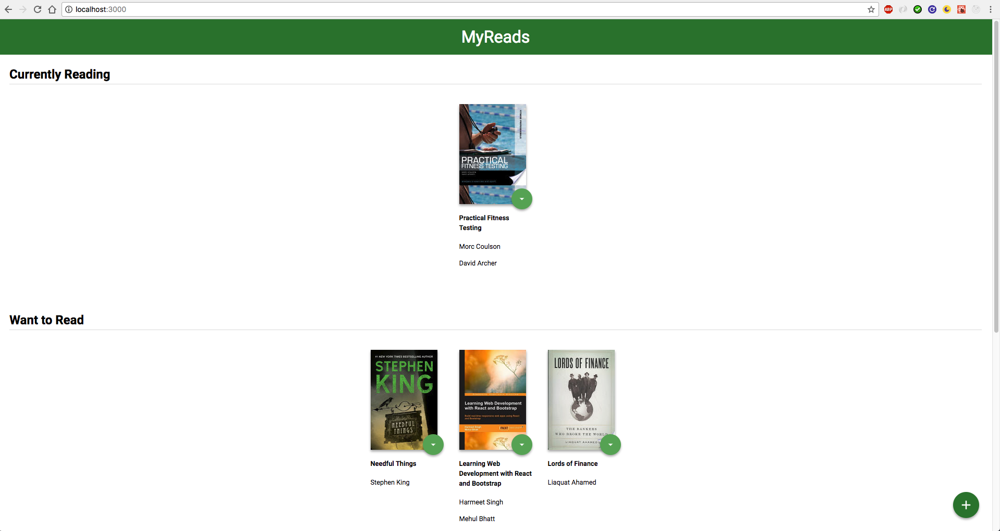
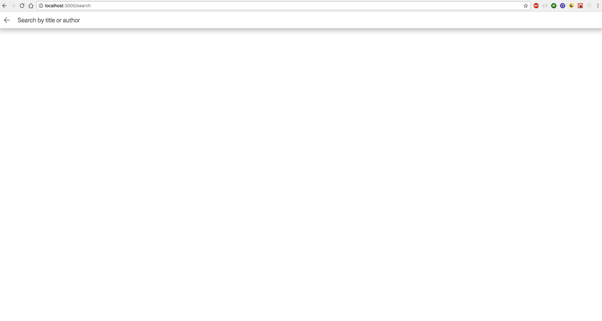
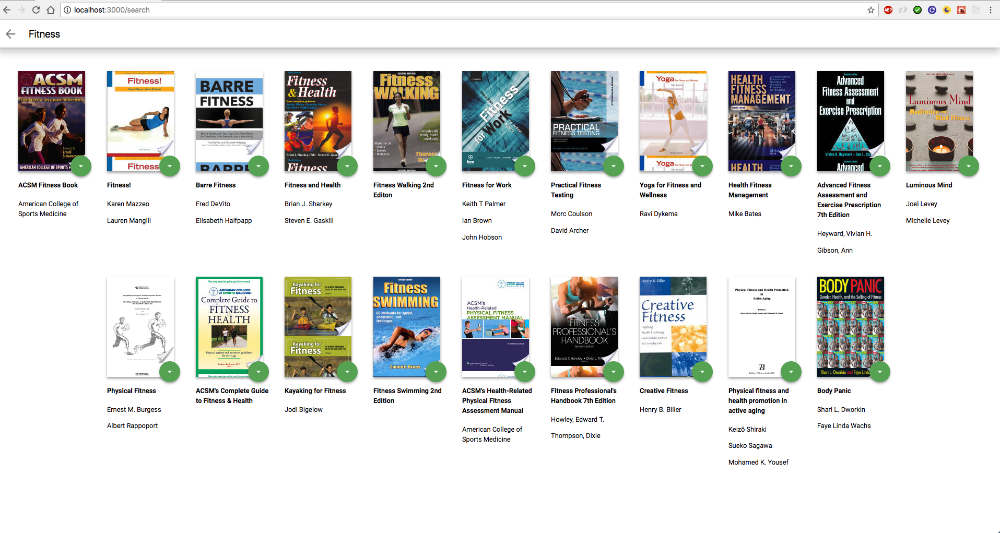

# My-Reads

MyReads is my first project for my React Nanodegree. It allows you to search for books that you want to read, as well as organize books onto shelves of "Currently Reading", "Want to Read," and "Read."

Quickstart

Install

Clone the project and type "npm install" inside the project folder in your terminal.

Run

To run the app, type "npm start" in the terminal.

Example Screenshots

---

---

Lisence

This is a modified project file under the ownership of Udacity.com. Feel free to modify however you wish.
